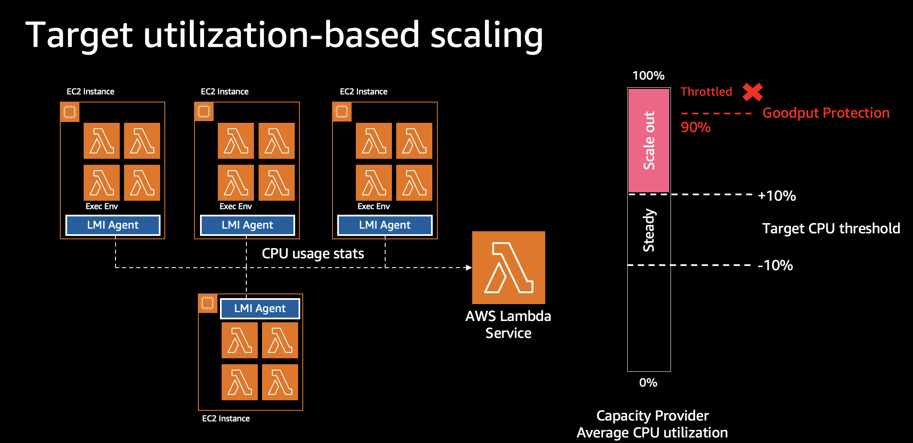

# Workshop: Lambda Managed Instances con Rust

Workshop paso a paso para desplegar funciones AWS Lambda sobre **Lambda Managed Instances (LMI)** usando **Rust** y procesadores **Graviton (arm64)**.

Lambda Managed Instances ejecuta tus funciones en instancias EC2 gestionadas por Lambda con multi-concurrencia, sin cold starts y con pricing de EC2. Este workshop adapta el workshop oficial de AWS (originalmente en Python) a Rust, con un **procesador de datos de vuelos** que analiza millones de filas usando [Polars](https://pola.rs/) para operaciones columnares de alto rendimiento.

## Arquitectura

```
                  ┌──────────────────────────────────────┐
                  │          Capacity Provider           │
                  │   VPC · Subnets · Security Group     │
                  └───────────────────┬──────────────────┘
                                      │
              ┌───────────────────────┼───────────────────────┐
              │                       │                       │
              ▼                       ▼                       ▼
     ┌─────────────────┐     ┌─────────────────┐     ┌─────────────────┐
     │    Graviton     │     │    Graviton     │     │    Graviton     │
     │   us-east-1a    │     │   us-east-1b    │     │   us-east-1c    │
     │     (arm64)     │     │     (arm64)     │     │     (arm64)     │
     └────────┬────────┘     └────────┬────────┘     └────────┬────────┘
              │                       │                       │
              ▼                       ▼                       ▼
     ┌─────────────────┐     ┌─────────────────┐     ┌─────────────────┐
     │  8 async tasks  │     │  8 async tasks  │     │  8 async tasks  │
     │     per vCPU    │     │     per vCPU    │     │     per vCPU    │
     │     (Tokio)     │     │     (Tokio)     │     │     (Tokio)     │
     └─────────────────┘     └─────────────────┘     └─────────────────┘
```

## Que hace la funcion

La funcion Lambda procesa datos de vuelos (formato CSV del Bureau of Transportation Statistics) ejecutando un pipeline completo de analisis:

1. **Carga**: CSV via Base64 inline o generacion de datos sinteticos
2. **Estadisticas basicas**: Total de vuelos, cancelaciones, delay promedio
3. **Analisis de vuelos**: Top 5 aerolineas, top 5 rutas, delay por mes, top 10 aeropuertos
4. **Operaciones avanzadas**: Filtrado complejo, agregaciones por carrier, analisis temporal por hora, columnas derivadas (DelayCategory, DistanceKm, AvgSpeedMph)

### Performance observado en LMI

| Config | Dataset | Tiempo total |
|---|---|---|
| 1 vCPU / 2 GB | 2M filas | ~1.8s |
| 2 vCPUs / 4 GB | 5M filas | ~3.3s |
| 4 vCPUs / 8 GB | 5M filas | pendiente |

## Requisitos previos

| Herramienta | Version minima |
|---|---|
| Rust | 1.84.0 |
| `cargo-lambda` | Ultima version |
| AWS CLI | v2 |
| Cuenta AWS | Con permisos para Lambda, EC2, IAM, VPC |

## Estructura del repositorio

```
.
├── README.md
├── documents/                        # Documentacion de referencia del workshop original (Python, en ingles)
│   ├── DOC-001.md                    #   Decision framework: cuando usar LMI
│   ├── DOC-002.md                    #   Crear capacity provider
│   ├── DOC-003.md                    #   Desplegar primera funcion
│   ├── DOC-004.md                    #   Durable functions sobre LMI (patron CDK)
│   ├── DOC-005.md                    #   Deep dive: throttling y escalado
│   ├── DOC-006.md                    #   Multi-tenancy y seguridad: introduccion
│   ├── DOC-007.md                    #   Estrategias de agrupacion de cargas
│   ├── DOC-008.md                    #   Desplegar multi-tenant y verificar aislamiento
│   ├── DOC-009.md                    #   Encriptacion KMS de volumenes EBS
│   └── DOC-010.md                    #   Patrones de compliance y gobernanza
├── files/                            # Recursos estaticos (imagenes, diagramas)
│   ├── architecture-provider-per-tenant.png
│   ├── architecture-provider-per-trust.png
│   ├── architecture-scaling-throttle.png
│   └── architecture-shared-provider.png
└── workshop/                         # Workshop adaptado a Rust
    ├── WORKSHOP-RUST-LMI.md          #   Guia paso a paso, modulos 1-10
    ├── WORKSHOP-MULTI-TENANCY.md     #   Guia paso a paso, modulos 11-14
    ├── .env.example                  #   Plantilla de variables (el .env real se genera)
    ├── setup-capacity-provider.sh    #   Script: configurar variables y crear capacity provider
    ├── deploy-rust-function.sh       #   Script: compilar, desplegar, publicar e invocar
    ├── invoke.sh                     #   Script: invocar con datos generados o CSV propio
    ├── invoke-parallel.sh            #   Script: prueba de carga con invocaciones concurrentes
    ├── cleanup.sh                    #   Script: borrar funcion, versiones, capacity provider y .env
    ├── setup-tenant-b.sh             #   Script: segundo capacity provider (Tenant B) + su funcion
    ├── setup-encrypted-cp.sh         #   Script: capacity provider con encriptacion KMS de EBS
    ├── demo-isolation.sh             #   Script: demo de aislamiento noisy-neighbor entre providers
    ├── cleanup-multi-tenancy.sh      #   Script: borrar solo los recursos de multi-tenancy
    └── rust-function/                #   Codigo fuente de la funcion Lambda
        ├── Cargo.toml                #     Polars 0.55, lambda_runtime, base64, rand
        └── src/
            └── main.rs               #     Procesador de vuelos con Polars + run_concurrent()
```

## Inicio rapido

### 1. Instalar herramientas

```bash
# Rust
curl --proto '=https' --tlsv1.2 -sSf https://sh.rustup.rs | sh
source "$HOME/.cargo/env"

# cargo-lambda
cargo install cargo-lambda
```

### 2. Crear el Capacity Provider

El script auto-descubre recursos de tu cuenta (VPC, subnets, roles con tag `*LMI*`), pide confirmacion, y crea el capacity provider:

```bash
bash workshop/setup-capacity-provider.sh
```

Esto genera `workshop/.env` (modo `600`) con las variables que consumen el resto de los scripts.

#### Variables de `workshop/.env`

No necesitas crear el archivo a mano: cada script lo lee con `source` y `setup-capacity-provider.sh` pregunta los valores que falten. [`workshop/.env.example`](workshop/.env.example) documenta el formato de cada variable si prefieres rellenarlo tu.

| Variable | Escrita por | Descripcion |
|---|---|---|
| `VPC_ID` | `setup-capacity-provider.sh` | VPC donde corren las instancias gestionadas (`vpc-...`) |
| `SUBNET_IDS` | `setup-capacity-provider.sh` | Subnets separadas por coma, sin corchetes ni espacios (`subnet-a,subnet-b`) |
| `SECURITY_GROUP_ID` | `setup-capacity-provider.sh` | Security group de las instancias (`sg-...`) |
| `OPERATOR_ROLE_ARN` | `setup-capacity-provider.sh` | Rol que Lambda asume para operar las instancias EC2 |
| `EXECUTION_ROLE_ARN` | `setup-capacity-provider.sh` | Rol de ejecucion de la funcion Lambda |
| `CP_ARN` | `setup-capacity-provider.sh` | ARN del capacity provider, añadido cuando pasa a `Active` |
| `LMI_VERSION` | `deploy-rust-function.sh` | Version publicada de la funcion; default de `invoke.sh` e `invoke-parallel.sh` |
| `TENANT_B_VERSION` | `setup-tenant-b.sh` | Version publicada de la funcion de Tenant B; la usa `demo-isolation.sh` |
| `MEMORY_SIZE` | manual (opcional) | Memoria de la funcion en MB. Default: `2048`. Con ratio 2:1, cada 2048 MB = 1 vCPU |
| `MEM_VCPU_RATIO` | manual (opcional) | Ratio memoria-a-vCPU en GB: `2.0` (compute), `4.0` (balanced), `8.0` (memory). Default: `2.0` |
| `ARCHITECTURE` | manual (opcional) | Arquitectura: `arm64` (Graviton) o `x86_64`. Default: `arm64` |
| `TIMEOUT` | manual (opcional) | Timeout en segundos. Default: `120`. LMI soporta hasta 5400s async |
| `MAX_CONCURRENCY` | manual (opcional) | `PerExecutionEnvironmentMaxConcurrency`: 2, 4, 8 o 16 tasks/vCPU. Default: `8` |

`REGION` y `ACCOUNT_ID` aparecen en los prerrequisitos de la guia de multi-tenancy, pero ningun script los lee ni los escribe: solo hacen falta para los comandos que copias a mano. Puedes definirlos en tu shell o en el `.env`.

> `setup-capacity-provider.sh` actualiza las cinco variables de infraestructura sin borrar las demas. `cleanup.sh` elimina solo `LMI_VERSION` y `CP_ARN` (las que quedan invalidas), conservando el resto. Como el `.env` contiene identificadores de tu cuenta, no lo subas al repositorio.

### 3. Compilar y desplegar la funcion Rust

El script compila para arm64 con Polars, despliega la funcion con timeout de 120s, publica una version, espera a que este activa, la invoca y muestra las instancias EC2:

```bash
bash workshop/deploy-rust-function.sh
```

### 4. Invocar

```bash
# Generar 50,000 filas sinteticas de vuelos
bash workshop/invoke.sh -g 50000

# Generar 5 millones de filas
bash workshop/invoke.sh -g 5000000

# Enviar tu propio CSV (max ~4 MB para invocacion sincrona)
bash workshop/invoke.sh -f tu_archivo.csv

# Especificar version manualmente
bash workshop/invoke.sh -g 50000 -v 3
```

### Ejemplo de respuesta

```json
{
    "status_code": 200,
    "processing": {
        "source": "generated_5050000_rows",
        "rows": 5050000,
        "memory_mb": 503.88,
        "load_duration_seconds": 3.334
    },
    "stats": {
        "total_flights": 5050000,
        "cancelled_flights": 101417,
        "avg_delay_minutes": 74.99
    },
    "analysis": {
        "top_carriers": [{"carrier": "WN", "flights": 505929}],
        "top_routes": [{"route": "SLC-SEA", "flights": 13654}],
        "delay_by_month": [{"month": 1, "avg_delay": 74.99}],
        "top_airports": [{"airport": "SAN", "flights": 253315}]
    },
    "advanced": {
        "filtered_delayed_long_distance": 3334596,
        "carrier_performance": [...],
        "delay_by_departure_hour": [...],
        "delay_categories": [
            {"category": "VeryDelayed", "count": 2916086},
            {"category": "OnTime", "count": 374918}
        ]
    },
    "total_duration_seconds": 4.169
}
```

### 5. Prueba de carga paralela

`invoke-parallel.sh` lanza varias invocaciones concurrentes contra la version publicada de la funcion, cada una generando su propio dataset sintetico. Sirve para ver la multi-concurrencia de LMI en accion y para provocar throttling de forma controlada.

```bash
# 5 invocaciones x 2M filas = 10M filas (defaults)
bash workshop/invoke-parallel.sh

# 10 invocaciones x 2M filas = 20M filas
bash workshop/invoke-parallel.sh -c 10

# 8 invocaciones x 5M filas = 40M filas
bash workshop/invoke-parallel.sh -c 8 -r 5000000

# Apuntar a una version publicada especifica
bash workshop/invoke-parallel.sh -c 10 -v 3
```

| Opcion | Descripcion | Default |
|---|---|---|
| `-c`, `--concurrency N` | Invocaciones lanzadas en paralelo | `5` |
| `-r`, `--rows ROWS` | Filas sinteticas por invocacion | `2000000` |
| `-v`, `--version VER` | Version publicada a invocar | `$LMI_VERSION` de `.env`, o `1` |
| `-h`, `--help` | Mostrar ayuda | — |

Cada invocacion corre en background y reporta su resultado individual: `OK` con el tiempo total del cliente y el `load_duration_seconds` que devuelve la funcion, `ERROR` si la funcion fallo (muestra el `errorType`), o `FAIL` si la llamada del CLI fallo (por ejemplo `TooManyRequestsException` cuando se agotan los slots de concurrencia).

```
============================================
  Prueba de carga paralela — Lambda LMI
============================================
Función:       lmi-workshop-rust-function:1
Invocaciones:  5
Filas/inv:     2,000,000
Total filas:   10,000,000
============================================

Lanzando 5 invocaciones...

  [#1] OK     2314ms total, 1.802s función
  [#2] OK     2401ms total, 1.851s función
  ...

============================================
  Resumen
============================================
Tiempo total:  2456ms
Exitosas:      5 / 5
Fallidas:      0 / 5
Throughput:    4,071,661 filas/seg
============================================

Respuestas guardadas en: /tmp/lmi-parallel-12345/
```

El resumen final incluye tiempo total de la oleada, cuenta de exitosas/fallidas y throughput agregado en filas/seg. Las respuestas completas y los logs quedan en `/tmp/lmi-parallel-$$/` (un directorio por ejecucion, nombrado con el PID) para inspeccionarlas despues. Si hubo fallos, se imprime al final el detalle de cada uno.

> El script lee `workshop/.env` para resolver `LMI_VERSION`, asi que ejecuta primero `setup-capacity-provider.sh` y `deploy-rust-function.sh`. Recuerda que solo las versiones publicadas corren sobre LMI — `$LATEST` no provisiona instancias.

## Diferencias clave: Rust vs Python en LMI

| Aspecto | Python | Rust |
|---|---|---|
| Runtime | `python3.14` | `provided.al2023` |
| Concurrencia por vCPU | 16 (procesos separados) | 8 (async tasks Tokio) |
| Entry point | `lambda_handler(event, context)` | `run_concurrent(service_fn(handler))` |
| Feature flag | No necesario | `concurrency-tokio` en `Cargo.toml` |
| Thread safety | Automatica (procesos separados) | Manual: handler `Clone + Send`, `Arc` para estado compartido |
| Packaging | Zip con `.py` | Zip con binario `bootstrap` compilado |
| Dependencia minima | N/A | `lambda_runtime >= 1.1.1` |

## Escalar con mas vCPUs

LMI permite escalar la funcion aumentando memoria (con ratio 2:1, cada 2 GB = 1 vCPU). Polars paraleliza automaticamente. Configura `MEMORY_SIZE` en `workshop/.env` y re-despliega:

```bash
# Ejemplo: 4 vCPUs (con ratio 2:1)
# En workshop/.env:
#   MEMORY_SIZE=8192
bash workshop/deploy-rust-function.sh
```

A diferencia de Lambda estandar (max 10 GB), LMI no tiene limite fijo de memoria — depende del tipo de instancia EC2 que Lambda seleccione.

## Configurar la funcion via `.env`

`deploy-rust-function.sh` lee estas variables opcionales de `workshop/.env`. Si no se definen, usa los defaults indicados. Son los mismos parametros que aparecen en la [calculadora de costos](pricing-calculator/).

```bash
# Ejemplo: funcion con 4 vCPUs, ratio balanced, concurrencia baja para Polars
MEMORY_SIZE=8192
MEM_VCPU_RATIO=2.0
ARCHITECTURE=arm64
TIMEOUT=120
MAX_CONCURRENCY=4
```

Despues de cambiar valores, re-despliega:

```bash
bash workshop/deploy-rust-function.sh
```

### Parametros

| Variable | Valor | Default | Descripcion |
|---|---|---|---|
| `MEMORY_SIZE` | MB (ej. `2048`, `4096`, `8192`) | `2048` | Memoria de la funcion. Con ratio 2:1, cada 2048 MB = 1 vCPU |
| `MEM_VCPU_RATIO` | `2.0`, `4.0`, `8.0` | `2.0` | GB de memoria por vCPU. 2.0 = compute, 4.0 = balanced, 8.0 = memory |
| `ARCHITECTURE` | `arm64`, `x86_64` | `arm64` | arm64 (Graviton) es ~20% mas barato que x86_64 |
| `TIMEOUT` | segundos (max 5400) | `120` | LMI soporta hasta 90 min para invocaciones async |
| `MAX_CONCURRENCY` | `2`, `4`, `8`, `16` | `8` | Tokio tasks por vCPU (`PerExecutionEnvironmentMaxConcurrency`) |

### Concurrencia por vCPU

| Valor | Uso recomendado | CPU por task |
|---|---|---|
| `2` | CPU-intensive: procesamiento de datos con Polars, compresion, crypto | ~50% |
| `4` | Balanced: APIs con logica de negocio + I/O moderado | ~25% |
| `8` | **Default Rust LMI.** Workloads con I/O moderado | ~12.5% |
| `16` | IO-heavy: proxies, colas, llamadas a DynamoDB/S3 donde tasks estan mayormente en `await` | ~6% |

Menos concurrencia = menos tasks compitiendo por CPU = menor latencia por request, pero se necesitan mas instancias para la misma concurrencia total. Mas concurrencia = mejor throughput agregado para workloads IO-bound, pero cada task individual tarda mas si necesita CPU.

## Multi-tenancy y seguridad

En LMI **el capacity provider es la frontera de seguridad** — no el contenedor. Dos funciones en el mismo provider comparten instancias EC2 y no estan aisladas entre si. La guia [`workshop/WORKSHOP-MULTI-TENANCY.md`](workshop/WORKSHOP-MULTI-TENANCY.md) cubre las estrategias de agrupacion, encriptacion y gobernanza, con estos scripts:

```bash
# Crear un segundo capacity provider (Tenant B) y desplegar una funcion en el
bash workshop/setup-tenant-b.sh

# Demo: saturar Tenant A y verificar que Tenant B no se ve afectado
bash workshop/demo-isolation.sh

# Capacity provider con encriptacion KMS de volumenes EBS
# (requiere la llave alias/lmi-workshop-ebs-key en estado Enabled)
bash workshop/setup-encrypted-cp.sh

# Borrar solo los recursos de multi-tenancy (conserva el provider principal)
bash workshop/cleanup-multi-tenancy.sh
```

Estos scripts asumen que ya existen el capacity provider principal en estado `Active` y una version publicada de la funcion (`LMI_VERSION` en `workshop/.env`). `demo-isolation.sh` requiere ademas la funcion `lmi-workshop-load-test`, desplegada por el stack del workshop.

## Limpieza

Las instancias EC2 corren 24/7 mientras exista el capacity provider. Para dejar de incurrir en costos, usa el script de limpieza (borra funcion, versiones, capacity provider y `workshop/.env`):

```bash
bash workshop/cleanup.sh
```

O manualmente:

```bash
# 1. Borrar la funcion
aws lambda delete-function --function-name lmi-workshop-rust-function

# 2. Borrar el capacity provider (termina las instancias automaticamente)
aws lambda delete-capacity-provider --capacity-provider-name lmi-workshop-capacity-provider
```

Si ejecutaste el modulo de multi-tenancy, corre tambien `bash workshop/cleanup-multi-tenancy.sh` para eliminar los providers de Tenant B y el encriptado.

Verifica que las instancias fueron terminadas:

```bash
aws ec2 describe-instances \
  --include-managed-resources \
  --filters "Name=tag:aws:lambda:capacity-provider,Values=*lmi-workshop-capacity-provider" \
            "Name=instance-state-name,Values=running" \
  --query "Reservations[*].Instances[*].[InstanceId,State.Name]" \
  --output table
```

## Deep Dive: Throttling y escalado en LMI

### Por que ocurre throttling con CPU bajo?



Con Lambda estandar, el throttling ocurre al alcanzar los limites de concurrencia a nivel de cuenta. Con LMI, el throttling ocurre cuando **todos los execution environments alcanzan su max concurrency configurada**, sin importar la utilizacion de CPU.

Configuracion por defecto:

- **3 execution environments** (minimo por defecto)
- **16 solicitudes concurrentes por vCPU** (default de Python)
- **1 vCPU por environment** (2 GB de memoria con ratio 2:1)

Esto da capacidad para **48 solicitudes concurrentes**. Para provocar throttling, se necesitan mas de 48 solicitudes concurrentes.

> **Nota para la funcion en Rust**: el runtime de Rust usa **8 tareas async por vCPU** en lugar de 16, asi que con la misma configuracion (3 environments x 1 vCPU) la capacidad es de **24 slots**, no 48. Los numeros de las fases siguientes vienen del workshop original en Python; con la funcion Rust el throttling aparece antes y los conteos de exitosas seran menores.

### Fase 1: Provocar throttling

Usar la funcion `lmi-workshop-load-test` para enviar 60 solicitudes concurrentes (excediendo la capacidad de 48 slots):

```bash
aws lambda invoke --function-name lmi-workshop-load-test \
  --payload '{"target_function": "lmi-workshop-rust-function:'$LMI_VERSION'", "concurrency": 60, "payload": {"count": 500000}}' \
  --cli-binary-format raw-in-base64-out ./throttle-test.json

cat ./throttle-test.json | python3 -m json.tool
```

Resultado esperado: ~48 requests exitosos y el resto throttled, confirmando que la saturacion de concurrencia (no CPU) es el disparador.

### Fase 2: Carga sostenida para escalar

Enviar 250 solicitudes concurrentes en 6 oleadas con 30 segundos de separacion:

```bash
for WAVE in $(seq 1 6); do
  echo "--- Wave $WAVE ($(date +%H:%M:%S)) ---"
  aws lambda invoke --function-name lmi-workshop-load-test \
    --payload '{"target_function": "lmi-workshop-rust-function:'$LMI_VERSION'", "concurrency": 250, "payload": {"count": 500000}}' \
    --cli-binary-format raw-in-base64-out ./wave-$WAVE.json > /dev/null 2>&1
  cat ./wave-$WAVE.json | python3 -c "import json,sys; d=json.load(sys.stdin); body=json.loads(d['body']); print(f'  Success: {body[\"success\"]}, Throttled: {body[\"throttled\"]}')"
  if [ $WAVE -lt 6 ]; then sleep 30; fi
done
```

Durante los ~2.5 minutos, el conteo de throttles deberia disminuir a medida que el capacity provider escala:

- **Wave 1:** Algunos requests throttled mientras el escalado comienza
- **Waves posteriores:** Menos throttling a medida que nuevas instancias entran en linea

### Observar el escalado

```bash
aws ec2 describe-instances \
  --include-managed-resources \
  --filters "Name=tag:aws:lambda:capacity-provider,Values=*lmi-workshop-capacity-provider" \
            "Name=instance-state-name,Values=running" \
  --query "Reservations[*].Instances[*].[InstanceId,InstanceType,LaunchTime]" \
  --output table
```

Se deberian ver mas de las 3 instancias originales. Lambda puede usar diferentes tipos de instancia (ej. `m7a.xlarge` y `m7i.xlarge`) segun disponibilidad.

### Observar las metricas

Concurrencia por execution environment:

```bash
aws cloudwatch get-metric-statistics \
  --namespace AWS/Lambda \
  --metric-name ExecutionEnvironmentConcurrency \
  --dimensions Name=CapacityProviderName,Value=lmi-workshop-capacity-provider \
               Name=FunctionName,Value=lmi-workshop-rust-function \
               Name=Resource,Value=lmi-workshop-rust-function:$LMI_VERSION \
  --start-time $(python3 -c "from datetime import datetime,timedelta,timezone; print((datetime.now(timezone.utc)-timedelta(minutes=30)).strftime('%Y-%m-%dT%H:%M:%S'))") \
  --end-time $(python3 -c "from datetime import datetime,timezone; print(datetime.now(timezone.utc).strftime('%Y-%m-%dT%H:%M:%S'))") \
  --period 300 --statistics Maximum --output table
```

Utilizacion de CPU:

```bash
aws cloudwatch get-metric-statistics \
  --namespace AWS/Lambda \
  --metric-name CPUUtilization \
  --dimensions Name=CapacityProviderName,Value=lmi-workshop-capacity-provider \
  --start-time $(python3 -c "from datetime import datetime,timedelta,timezone; print((datetime.now(timezone.utc)-timedelta(minutes=15)).strftime('%Y-%m-%dT%H:%M:%S'))") \
  --end-time $(python3 -c "from datetime import datetime,timezone; print(datetime.now(timezone.utc).strftime('%Y-%m-%dT%H:%M:%S'))") \
  --period 300 --statistics Average --output table
```

El resultado clave: **la concurrencia alcanza el maximo (16 por environment) mientras CPU esta en solo 1-6%.** Las instancias apenas estan trabajando, pero los requests son throttled. El cuello de botella son los slots de concurrencia, no la capacidad de computo.

### Insight clave

**LMI no escala como Lambda estandar.** Lambda estandar escala lanzando nuevos execution environments cuando llegan invocaciones. LMI escala monitoreando el consumo de recursos y la saturacion de concurrencia, y luego provisionando instancias adicionales de forma asincrona.

- Throttling ocurre cuando la concurrencia esta saturada, **no cuando CPU esta alto**
- El escalado es **asincrono** — toma 1-2 minutos para que nuevas instancias esten en linea
- Una vez escalado, la capacidad adicional maneja oleadas subsecuentes sin throttling
- Si el throttling persiste en oleadas posteriores, se alcanzo el limite `MaxVCpuCount`

## Modulos del workshop

La guia principal esta en [`workshop/WORKSHOP-RUST-LMI.md`](workshop/WORKSHOP-RUST-LMI.md) y cubre:

1. **Cuando usar LMI** - Decision framework y tabla comparativa
2. **Crear Capacity Provider** - VPC, subredes, security group, operator role
3. **Escribir la funcion en Rust** - Procesador CSV con Polars, Request/Response, pipeline
4. **Compilar y desplegar** - cargo-lambda, create-function con provided.al2023
5. **Publicar e invocar** - publish-version, datos generados y CSV Base64
6. **Patrones avanzados de concurrencia** - Arc, clientes AWS SDK, logging, X-Ray
7. **Timeout de 90 minutos** - Invocaciones async de larga duracion
8. **Graceful shutdown** - Manejo de SIGTERM
9. **Limpieza** - Eliminar recursos en orden correcto
10. **Prueba de carga paralela** - Invocaciones concurrentes con `invoke-parallel.sh`

La continuacion esta en [`workshop/WORKSHOP-MULTI-TENANCY.md`](workshop/WORKSHOP-MULTI-TENANCY.md) (~30 min):

11. **Estrategias de agrupacion de cargas** - Provider compartido, por tenant, por nivel de confianza
12. **Desplegar multi-tenant y verificar aislamiento** - Segundo provider, demo noisy-neighbor
13. **Encriptacion KMS para volumenes EBS** - Llave gestionada por el cliente
14. **Patrones de compliance y gobernanza** - IMDSv2, SCPs, `lambda:PassCapacityProvider`

## Referencias

- [Lambda Managed Instances overview](https://docs.aws.amazon.com/lambda/latest/dg/lambda-managed-instances.html)
- [Rust support for Lambda Managed Instances](https://docs.aws.amazon.com/lambda/latest/dg/lambda-managed-instances-rust.html)
- [Deploy Rust Lambda functions](https://docs.aws.amazon.com/lambda/latest/dg/rust-package.html)
- [Build high-performance apps with LMI (blog)](https://aws.amazon.com/blogs/compute/build-high-performance-apps-with-aws-lambda-managed-instances/)
- [Polars documentation](https://docs.pola.rs/)
