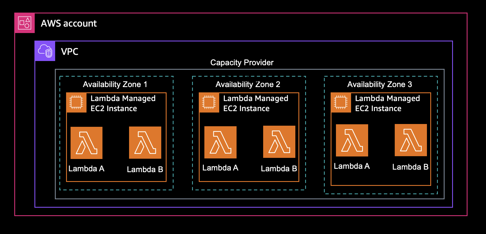
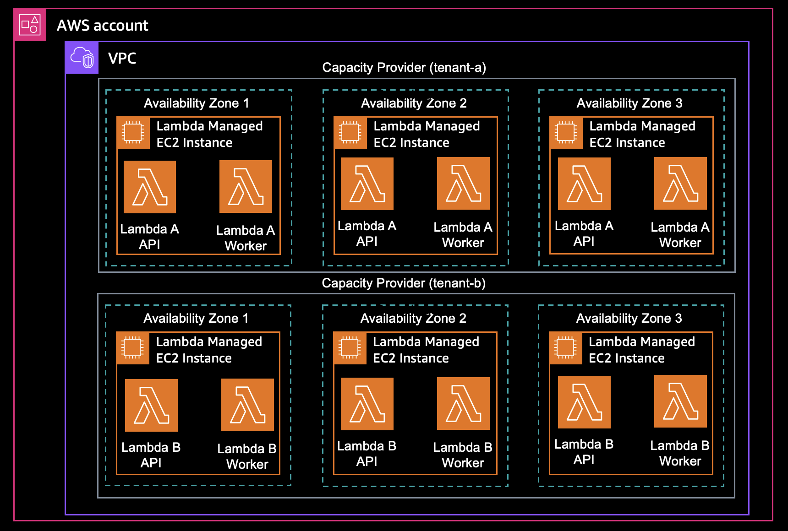
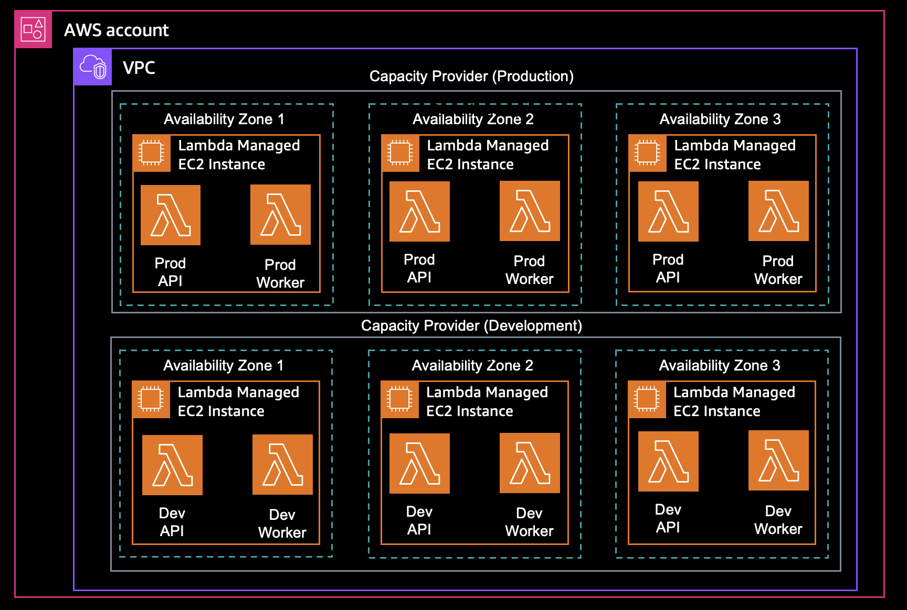

# Workshop: Multi-Tenancy y Seguridad en Lambda Managed Instances

## Descripción General

Este módulo profundiza en las decisiones de aislamiento, seguridad y gobernanza que debes tomar al desplegar Lambda Managed Instances en entornos de producción. En LMI, **el capacity provider es la frontera de seguridad** — no el contenedor. Esa distinción guía todas las decisiones de este módulo.

### ¿Qué vas a lograr?

1. Entender por qué el capacity provider es la frontera de seguridad
2. Evaluar tres estrategias de agrupación de cargas (compartido, aislado, híbrido)
3. Desplegar un segundo capacity provider y verificar el aislamiento
4. Configurar encriptación KMS para volúmenes EBS en instancias gestionadas
5. Verificar IMDSv2 y revisar hallazgos de compliance
6. Aplicar patrones de gobernanza empresarial (SCPs, convenciones de nombres, control de acceso)

### Conceptos clave

| Concepto | Descripción |
|---|---|
| Frontera de seguridad | El capacity provider, no el contenedor, proporciona aislamiento entre cargas |
| Provider compartido | Múltiples funciones en un provider: mejor utilización, menor costo, sin aislamiento cruzado |
| Provider aislado | Un provider por tenant o nivel de confianza: aislamiento fuerte, mayor costo base |
| `lambda:PassCapacityProvider` | Acción IAM que controla qué usuarios pueden asignar funciones a qué providers |
| Encriptación KMS | Llave gestionada por el cliente para volúmenes EBS en instancias gestionadas |
| IMDSv2 | Seguridad de metadatos de instancia, enforced por defecto en todas las instancias gestionadas |

> **Importante**: Los contenedores dentro de un capacity provider NO proporcionan aislamiento de seguridad. Nunca coloques cargas mutuamente no confiables en el mismo capacity provider.

### Prerequisitos

Este módulo se construye sobre los recursos creados en los módulos anteriores. Necesitas:

1. Un capacity provider en estado **Active** (`lmi-workshop-capacity-provider`)
2. Una función LMI con una versión publicada en estado **Active** (`lmi-workshop-rust-function`)
3. Variables de entorno configuradas (`REGION`, `ACCOUNT_ID`, `OPERATOR_ROLE_ARN`, `EXECUTION_ROLE_ARN`, `SUBNET_IDS`, `SECURITY_GROUP_ID`, `LMI_VERSION`)

Si abriste una terminal nueva, re-exporta las variables:

```bash
source workshop/.env
export LMI_VERSION=<tu versión publicada>
```

**Tiempo estimado:** 30 minutos

---

## Módulo 11: Estrategias de Agrupación de Cargas

Las decisiones de agrupación determinan tanto tu postura de aislamiento como tu factura. Cada capacity provider tiene un piso mínimo de **3 instancias EC2**, así que cada provider adicional que introduces incrementa tu costo base.

Tres patrones de agrupación cubren la mayoría de cargas de trabajo.

### Estrategia 1: Un provider compartido

Todas las funciones se conectan a un único capacity provider.



| Pros | Contras |
|---|---|
| Mejor utilización de recursos | Sin aislamiento entre funciones |
| Menor costo base (un piso de 3 instancias para todo) | Riesgo de noisy-neighbor entre cargas |
| Más simple de gestionar y monitorear | La misma política de scaling aplica a todas las funciones |

Usa esto cuando todas las funciones pertenecen al mismo equipo, comparten el mismo nivel de confianza y tienen perfiles de rendimiento similares.

### Estrategia 2: Un provider por tenant

Cada tenant o nivel de confianza obtiene su propio capacity provider.



| Pros | Contras |
|---|---|
| Aislamiento fuerte entre tenants | Mayor costo base (3 instancias por provider) |
| Política de scaling independiente por tenant | Más providers que gestionar |
| Sin riesgo de noisy-neighbor entre tenants | Menor utilización por provider |

Usa esto cuando los tenants no son mutuamente confiables, tienen SLAs diferentes o enfrentan requisitos regulatorios que exigen separación.

### Estrategia 3: Un provider por nivel de confianza

Agrupa funciones por nivel de confianza, no por tenant individual.



| Pros | Contras |
|---|---|
| Equilibra costo contra aislamiento | Requiere definiciones claras de nivel de confianza |
| Producción protegida de cargas dev/staging | Funciones dentro de un nivel aún comparten recursos |
| Número manejable de providers | Se necesita gobernanza para enforcer la colocación correcta |

Usa esto cuando tu organización tiene fronteras claras de ambiente (prod/staging/dev) o niveles de confianza (interno/externo, PCI/no-PCI).

### Cómo elegir estrategia

Recorre las preguntas en orden. El primer "sí" que requiere aislamiento termina el proceso:

| Pregunta | Si sí | Si no |
|---|---|---|
| ¿Los tenants tienen fronteras regulatorias o de compliance separadas? | Un provider por tenant | Continuar |
| ¿La falla o carga excesiva de una función podría afectar a otra? | Aislar por equipo o nivel | Continuar |
| ¿Las cargas necesitan diferentes políticas de scaling? | Providers separados por política | Continuar |
| ¿Todas las funciones pertenecen al mismo equipo y nivel de confianza? | Provider compartido es suficiente | Reconsiderar aislamiento por niveles |

### Cuotas de capacity providers

| Cuota | Límite | Impacto |
|---|---|---|
| Capacity providers por cuenta | 1,000 | No es una restricción típica, incluso con aislamiento por tenant |
| Versiones de función por capacity provider | 100 (límite duro, no se puede incrementar) | Limita cuántas versiones pueden compartir un provider. Si tienes muchos microservicios con deploys frecuentes, puedes alcanzar este límite en un provider compartido |

> **Nota**: Lambda cuenta cada versión publicada de función conectada a un capacity provider. Elimina versiones no utilizadas para mantenerte dentro del límite de 100 versiones.

### Service-linked role

Lambda usa el rol `AWSServiceRoleForLambda` para gestionar las instancias EC2 en tus capacity providers. Este rol se crea automáticamente la primera vez que creas un capacity provider. No necesitas crearlo manualmente, pero tu cuenta debe permitir la creación de service-linked roles (algunas organizaciones lo restringen via SCPs).

### Enforcing de placement con IAM

La acción `lambda:PassCapacityProvider` controla qué usuarios o roles pueden conectar funciones a qué capacity providers. Combinada con una convención de nombres, se convierte en el mecanismo para enforcer tu política de agrupación.

La siguiente política permite a su titular conectar funciones solo a capacity providers cuyos nombres empiecen con `production-`. Reemplaza `123456789012` con tu Account ID (`echo $ACCOUNT_ID`):

```json
{
  "Version": "2012-10-17",
  "Statement": [
    {
      "Effect": "Allow",
      "Action": "lambda:PassCapacityProvider",
      "Resource": "arn:aws:lambda:*:123456789012:capacity-provider:production-*"
    }
  ]
}
```

Un desarrollador con esta política no puede conectar una función a un provider `tenant-b-*` o a cualquier provider fuera del conjunto `production-*`.

---

## Módulo 12: Desplegar Multi-Tenant y Verificar Aislamiento

Crea un segundo capacity provider, despliega una función en él y demuestra que los dos providers corren en instancias EC2 completamente separadas.

### Paso 12.1: Verificar variables de entorno

```bash
echo "Subnets: $SUBNET_IDS"
echo "Security Group: $SECURITY_GROUP_ID"
echo "Operator Role: $OPERATOR_ROLE_ARN"
echo "Execution Role: $EXECUTION_ROLE_ARN"
echo "LMI Version: $LMI_VERSION"
```

Si algún valor está vacío, re-exporta las variables:

```bash
export SUBNET_IDS=$(aws ec2 describe-subnets \
  --filters "Name=tag:Name,Values=lmi-workshop-private-*" \
  --query "Subnets[*].SubnetId" --output text | tr '\t' ',')

export SECURITY_GROUP_ID=$(aws ec2 describe-security-groups \
  --filters "Name=tag:Name,Values=lmi-workshop-sg" \
  --query "SecurityGroups[0].GroupId" --output text)

export OPERATOR_ROLE_ARN=$(aws iam get-role \
  --role-name LMIWorkshopOperatorRole \
  --query "Role.Arn" --output text)

export EXECUTION_ROLE_ARN=$(aws iam get-role \
  --role-name LMIWorkshopExecutionRole \
  --query "Role.Arn" --output text)
```

### Paso 12.2: Crear el capacity provider de Tenant B

Representa "Tenant B" con un nuevo capacity provider. Usa la misma VPC que el existente pero tiene su propia frontera de seguridad con su propia flota de instancias:

```bash
aws lambda create-capacity-provider \
  --capacity-provider-name lmi-workshop-tenant-b-cp \
  --vpc-config "SubnetIds=[$SUBNET_IDS],SecurityGroupIds=[$SECURITY_GROUP_ID]" \
  --permissions-config "CapacityProviderOperatorRoleArn=$OPERATOR_ROLE_ARN" \
  --instance-requirements "Architectures=[x86_64]" \
  --capacity-provider-scaling-config "MaxVCpuCount=16" \
  --tags Tenant=tenant-b,Environment=workshop
```

Output esperado con estado `Creating`:

```json
{
    "CapacityProvider": {
        "CapacityProviderArn": "arn:aws:lambda:us-east-1:123456789012:capacity-provider:lmi-workshop-tenant-b-cp",
        "State": "Creating",
        "CapacityProviderScalingConfig": {
            "MaxVCpuCount": 16,
            "ScalingMode": "Auto"
        }
    }
}
```

Espera a que el provider pase a `Active`:

```bash
aws lambda get-capacity-provider \
  --capacity-provider-name lmi-workshop-tenant-b-cp \
  --query "CapacityProvider.State" \
  --output text
```

### Paso 12.3: Desplegar una función en Tenant B

Crea el zip de la función:

```bash
mkdir -p ./function
cat > ./function/lambda_function.py << 'EOF'
import json
import time

def lambda_handler(event, context):
    count = event.get("count", 1000)
    start = time.time()
    primes = []
    for num in range(2, count):
        is_prime = True
        for i in range(2, int(num**0.5) + 1):
            if num % i == 0:
                is_prime = False
                break
        if is_prime:
            primes.append(num)
    duration = time.time() - start
    return {"statusCode": 200, "body": json.dumps({"message": "Hello from Tenant B!", "primes_found": len(primes), "duration_seconds": round(duration, 3), "request_id": context.aws_request_id})}
EOF
cd ./function && zip function.zip lambda_function.py && cd ..
```

Conecta la función al provider de Tenant B:

```bash
export TENANT_B_CP_ARN=$(aws lambda get-capacity-provider \
  --capacity-provider-name lmi-workshop-tenant-b-cp \
  --query "CapacityProvider.CapacityProviderArn" \
  --output text)

aws lambda create-function \
  --function-name lmi-workshop-tenant-b-function \
  --runtime python3.14 \
  --handler lambda_function.lambda_handler \
  --zip-file fileb://function/function.zip \
  --role "$EXECUTION_ROLE_ARN" \
  --memory-size 2048 \
  --capacity-provider-config "LambdaManagedInstancesCapacityProviderConfig={CapacityProviderArn=$TENANT_B_CP_ARN,ExecutionEnvironmentMemoryGiBPerVCpu=2.0}"
```

Publica y espera a que esté activa:

```bash
TENANT_B_VERSION=$(aws lambda publish-version \
  --function-name lmi-workshop-tenant-b-function \
  --description "Tenant B initial deployment" \
  --query "Version" --output text)

echo "Published version: $TENANT_B_VERSION"

echo "Esperando a que la función de Tenant B esté Active..."
while [ "$(aws lambda get-function --function-name lmi-workshop-tenant-b-function:$TENANT_B_VERSION --query 'Configuration.State' --output text)" != "Active" ]; do
  echo "  Aún aprovisionando... ($(date +%H:%M:%S))"
  sleep 15
done
echo "¡Función activa!"
```

> **Nota**: Esta espera toma 2-5 minutos ya que Lambda aprovisiona nuevas instancias para el segundo capacity provider.

### Paso 12.4: Verificar que los providers corren en instancias separadas

Lista las instancias de cada provider lado a lado:

```bash
echo "=== Instancias Tenant A (lmi-workshop-capacity-provider) ==="
aws ec2 describe-instances \
  --include-managed-resources \
  --filters "Name=tag:aws:lambda:capacity-provider,Values=*lmi-workshop-capacity-provider" \
            "Name=instance-state-name,Values=running" \
  --query "Reservations[*].Instances[*].[InstanceId,InstanceType]" \
  --output table

echo ""
echo "=== Instancias Tenant B (lmi-workshop-tenant-b-cp) ==="
aws ec2 describe-instances \
  --include-managed-resources \
  --filters "Name=tag:aws:lambda:capacity-provider,Values=*lmi-workshop-tenant-b-cp" \
            "Name=instance-state-name,Values=running" \
  --query "Reservations[*].Instances[*].[InstanceId,InstanceType]" \
  --output table
```

Deberías ver dos conjuntos completamente separados de instancias. Ninguna instancia aparece en ambas listas.

### Paso 12.5: Demostrar aislamiento de noisy-neighbor

Primero, invoca Tenant B para obtener un tiempo de respuesta baseline:

```bash
echo "=== Tenant B baseline (sin carga) ==="
aws lambda invoke \
  --function-name lmi-workshop-tenant-b-function:$TENANT_B_VERSION \
  --payload '{"count": 5000}' \
  --cli-binary-format raw-in-base64-out ./tenant-b-baseline.json
cat ./tenant-b-baseline.json | python3 -c "import sys,json; d=json.load(sys.stdin); print('Duration:', json.loads(d['body'])['duration_seconds'], 'seconds')"
```

Ahora satura Tenant A con 50 requests concurrentes en background e invoca Tenant B mientras esa carga está en vuelo:

```bash
echo "=== Saturando Tenant A con 50 requests concurrentes (background) ==="
aws lambda invoke --function-name lmi-workshop-load-test \
  --payload '{"target_function": "lmi-workshop-function:'$LMI_VERSION'", "concurrency": 50, "payload": {"count": 500000}}' \
  --cli-binary-format raw-in-base64-out ./tenant-a-load.json >/dev/null 2>&1 &
LOAD_PID=$!

sleep 5

echo ""
echo "=== Invocando Tenant B mientras Tenant A está bajo carga ==="
aws lambda invoke \
  --function-name lmi-workshop-tenant-b-function:$TENANT_B_VERSION \
  --payload '{"count": 5000}' \
  --cli-binary-format raw-in-base64-out ./tenant-b-result.json
cat ./tenant-b-result.json | python3 -c "import sys,json; d=json.load(sys.stdin); print('Duration:', json.loads(d['body'])['duration_seconds'], 'seconds')"

wait $LOAD_PID

echo ""
echo "=== Resultado de carga en Tenant A ==="
cat ./tenant-a-load.json | python3 -m json.tool
```

Resultado esperado:

```
=== Tenant B baseline (sin carga) ===
Duration: 0.001 seconds

=== Invocando Tenant B mientras Tenant A está bajo carga ===
Duration: 0.001 seconds
```

Tenant B responde en menos de 1-2 ms sin importar la carga de Tenant A. Los dos providers comparten la VPC y el operator role pero nada más en runtime: instancias EC2 separadas, ambientes de ejecución separados, presupuestos de concurrencia separados.

> Si ambas funciones estuvieran en el mismo capacity provider, los 50 requests concurrentes de Tenant A podrían saturar los ambientes compartidos y Tenant B vería throttling o latencia elevada. El aislamiento elimina este riesgo de noisy-neighbor.

### El costo del aislamiento

| Enfoque | Instancias en reposo | Costo mensual aproximado |
|---|---|---|
| Compartido (un provider, ambas funciones) | 3 mínimo | ~$150 |
| Aislado (un provider por tenant) | 6 mínimo | ~$300 |

Doble aislamiento, doble costo base. Este es el trade-off detrás de cada decisión de multi-tenancy en LMI.

### Script automatizado

Para ejecutar todos los pasos de esta sección de forma automatizada:

```bash
bash workshop/setup-tenant-b.sh
bash workshop/demo-isolation.sh
```

---

## Módulo 13: Encriptación KMS para Volúmenes EBS

Por defecto, Lambda encripta los volúmenes EBS de las instancias gestionadas usando una llave administrada por AWS. Para cargas con requisitos de compliance más estrictos, una llave KMS gestionada por el cliente te da control sobre políticas de rotación, acceso entre cuentas y el audit trail en CloudTrail.

> **Importante**: La encriptación se configura **al momento de crear el capacity provider** y no se puede cambiar después.

### Paso 13.1: Verificar la llave KMS pre-aprovisionada

Una llave KMS gestionada por el cliente (`alias/lmi-workshop-ebs-key`) fue creada como parte de la infraestructura del workshop. La política de la llave ya otorga a tu operator role los permisos de encriptación requeridos, incluyendo `kms:CreateGrant`.

```bash
export KMS_KEY_ARN=$(aws kms describe-key \
  --key-id alias/lmi-workshop-ebs-key \
  --query "KeyMetadata.Arn" --output text)

echo "KMS Key ARN: $KMS_KEY_ARN"

aws kms describe-key \
  --key-id alias/lmi-workshop-ebs-key \
  --query "KeyMetadata.[KeyId,KeyState,Description]" \
  --output table
```

Deberías ver la llave en estado `Enabled`:

```
-----------------------------------------------------------------
|                          DescribeKey                          |
+---------------------------------------------------------------+
|  f5702009-d6b8-4bac-8044-ba507b0655df                         |
|  Enabled                                                      |
|  Customer-managed key for LMI workshop EBS volume encryption  |
+---------------------------------------------------------------+
```

La política de la llave otorga al operator role las acciones que Lambda necesita para encriptar volúmenes EBS: `kms:Encrypt`, `kms:Decrypt`, `kms:GenerateDataKey*`, `kms:DescribeKey` y `kms:CreateGrant`. El permiso `CreateGrant` es crítico porque EBS usa grants KMS para autorizar operaciones de encriptación de volumen cuando Lambda lanza instancias.

### Paso 13.2: Crear un capacity provider encriptado

Conecta la llave KMS a un nuevo capacity provider. Los capacity providers existentes no se pueden re-encriptar:

```bash
aws lambda create-capacity-provider \
  --capacity-provider-name lmi-workshop-encrypted-cp \
  --vpc-config "SubnetIds=[$SUBNET_IDS],SecurityGroupIds=[$SECURITY_GROUP_ID]" \
  --permissions-config "CapacityProviderOperatorRoleArn=$OPERATOR_ROLE_ARN" \
  --instance-requirements "Architectures=[x86_64]" \
  --capacity-provider-scaling-config "MaxVCpuCount=16" \
  --kms-key-arn $KMS_KEY_ARN
```

Verifica que el provider está activo y muestra la llave KMS:

```bash
aws lambda get-capacity-provider \
  --capacity-provider-name lmi-workshop-encrypted-cp \
  --query "CapacityProvider.[State,KmsKeyArn]" \
  --output table
```

```
---------------------------------------------------------------------------------
|                              GetCapacityProvider                              |
+-------------------------------------------------------------------------------+
|  Active                                                                       |
|  arn:aws:kms:us-east-1:123456789012:key/f5702009-...                          |
+-------------------------------------------------------------------------------+
```

### Paso 13.3: Desplegar función y verificar volúmenes encriptados

Crea el zip de la función (si no lo tienes del paso anterior):

```bash
mkdir -p ./function
cat > ./function/lambda_function.py << 'EOF'
import json
import time

def lambda_handler(event, context):
    count = event.get("count", 1000)
    start = time.time()
    primes = []
    for num in range(2, count):
        is_prime = True
        for i in range(2, int(num**0.5) + 1):
            if num % i == 0:
                is_prime = False
                break
        if is_prime:
            primes.append(num)
    duration = time.time() - start
    return {"statusCode": 200, "body": json.dumps({"message": "Hello from the encrypted capacity provider!", "primes_found": len(primes), "duration_seconds": round(duration, 3), "request_id": context.aws_request_id})}
EOF
cd ./function && zip function.zip lambda_function.py && cd ..
```

Despliega la función en el provider encriptado:

```bash
export ENCRYPTED_CP_ARN=$(aws lambda get-capacity-provider \
  --capacity-provider-name lmi-workshop-encrypted-cp \
  --query "CapacityProvider.CapacityProviderArn" \
  --output text)

aws lambda create-function \
  --function-name lmi-workshop-encrypted-function \
  --runtime python3.14 \
  --handler lambda_function.lambda_handler \
  --zip-file fileb://function/function.zip \
  --role "$EXECUTION_ROLE_ARN" \
  --memory-size 2048 \
  --capacity-provider-config "LambdaManagedInstancesCapacityProviderConfig={CapacityProviderArn=$ENCRYPTED_CP_ARN,ExecutionEnvironmentMemoryGiBPerVCpu=2.0}"

aws lambda publish-version \
  --function-name lmi-workshop-encrypted-function

echo "Esperando a que la función encriptada esté Active..."
while [ "$(aws lambda get-function --function-name lmi-workshop-encrypted-function:1 --query 'Configuration.State' --output text)" != "Active" ]; do
  echo "  Aún aprovisionando... ($(date +%H:%M:%S))"
  sleep 15
done
echo "¡Función activa!"
```

### Paso 13.4: Inspeccionar volúmenes EBS encriptados

Una vez activa, inspecciona los volúmenes conectados a las instancias encriptadas:

> **Nota**: Las instancias EC2 pueden tardar 1-2 minutos en aparecer después de que la función esté activa. Si el comando devuelve resultados vacíos, espera 30-60 segundos y reintenta.

```bash
INSTANCE_IDS=$(aws ec2 describe-instances \
  --include-managed-resources \
  --filters "Name=tag:aws:lambda:capacity-provider,Values=*lmi-workshop-encrypted-cp" \
            "Name=instance-state-name,Values=running" \
  --query "Reservations[*].Instances[*].InstanceId" \
  --output text)

for INSTANCE_ID in $INSTANCE_IDS; do
  echo "Instance: $INSTANCE_ID"
  aws ec2 describe-volumes \
    --include-managed-resources \
    --filters "Name=attachment.instance-id,Values=$INSTANCE_ID" \
    --query "Volumes[*].[VolumeId,Encrypted,KmsKeyId]" \
    --output table
done
```

Verás dos volúmenes por instancia: uno encriptado con tu CMK y uno no encriptado operacional gestionado por Lambda:

```
Instance: i-029e8f15f585b2b8a
+-----------------------+--------+--------------------------------------------------------------------------------+
|  vol-09be060233b6463c3|  True  |  arn:aws:kms:us-east-1:123456789012:key/f5702009-...                            |
|  vol-079335a82dfa4a041|  False |  None                                                                          |
+-----------------------+--------+--------------------------------------------------------------------------------+
```

El volumen encriptado (`True` + key ARN) es el volumen de datos de tu función, protegido por tu llave KMS gestionada por el cliente.

> La llave KMS queda fijada al momento de crear el capacity provider. Para cambiar llaves después, crea un nuevo capacity provider y migra tus funciones.

### Script automatizado

```bash
bash workshop/setup-encrypted-cp.sh
```

---

## Módulo 14: Patrones de Compliance y Gobernanza

Cuando despliegas LMI en un entorno regulado, los scanners de seguridad y herramientas de auditoría encontrarán tus instancias EC2 gestionadas y las evaluarán contra las mismas políticas que aplican a cargas EC2 normales. Algunos hallazgos ya son compliance. Algunos requieren una excepción documentada. Otros genuinamente necesitan acción de tu parte.

### IMDSv2 enforced por defecto

El Instance Metadata Service (IMDS) proporciona información a nivel de instancia al código ejecutándose en ella. IMDSv1 usa un modelo request-response vulnerable a ataques SSRF; IMDSv2 usa tokens de sesión y es el estándar requerido por la mayoría de frameworks de compliance.

LMI enforcea IMDSv2 en toda instancia gestionada. No necesitas configurarlo y no puedes revertir a IMDSv1.

Verifica en una de tus instancias existentes:

```bash
INSTANCE_ID=$(aws ec2 describe-instances \
  --include-managed-resources \
  --filters "Name=tag:aws:lambda:capacity-provider,Values=*lmi-workshop-capacity-provider" \
            "Name=instance-state-name,Values=running" \
  --query "Reservations[0].Instances[0].InstanceId" \
  --output text)

aws ec2 describe-instances \
  --instance-ids $INSTANCE_ID \
  --query "Reservations[0].Instances[0].MetadataOptions" \
  --output table
```

Output esperado:

```
------------------------------------------------------------------------------------------------------------------
|                                                DescribeInstances                                               |
+--------------+-------------------+--------------------------+-------------+------------------------+-----------+
| HttpEndpoint | HttpProtocolIpv6  | HttpPutResponseHopLimit  | HttpTokens  | InstanceMetadataTags   |   State   |
+--------------+-------------------+--------------------------+-------------+------------------------+-----------+
|  enabled     |  disabled         |  2                       |  required   |  disabled              |  applied  |
+--------------+-------------------+--------------------------+-------------+------------------------+-----------+
```

`HttpTokens: required` es la señal definitiva de que IMDSv2 está enforced e IMDSv1 está deshabilitado. El `HttpPutResponseHopLimit: 2` es necesario porque las funciones LMI corren dentro de contenedores en el host — un hop limit de 1 bloquearía el acceso al metadata service.

### Guía de triage de hallazgos de scanner

| Hallazgo | Estado en LMI | Acción recomendada |
|---|---|---|
| EC2 debe tener IMDSv1 deshabilitado | Compliance | Sin acción. `HttpTokens: required` ya está configurado |
| EC2 sin agente de monitoreo de host | No aplica | Instancias gestionadas no pueden hospedar agentes de terceros. Documentar como riesgo aceptado |
| EC2 no usa AMI aprobada | No aplica | Lambda elige y parchea el AMI. Documentar como control gestionado por AWS |
| EC2 sin tags requeridos | Accionable | Habilitar `PropagateTags` en el capacity provider |
| Volúmenes EBS deben estar encriptados con CMK | Accionable | Conectar llave KMS al capacity provider (paso anterior) |
| EC2 no está en VPC aprobada | Accionable | Conectar el capacity provider a una VPC y subredes aprobadas |
| Security group permite egress sin restricción | Evaluar | Depende de tu política de egress. Ver sección siguiente |

### Hallazgos que no puedes corregir

Estos hallazgos aparecerán contra instancias LMI y no hay nada operacional que puedas hacer para cerrarlos, porque el control subyacente es propiedad de AWS:

- **No se pueden instalar agentes de monitoreo** (CrowdStrike, Qualys, IDS basado en host): Lambda gestiona el OS
- **No se puede modificar el AMI**: Lambda lo selecciona y parchea
- **No se pueden cambiar configuraciones IMDS** después del lanzamiento: se enforcean al momento del lanzamiento
- **No se pueden conectar instance profiles de IAM** directamente: el operator role del capacity provider maneja permisos a nivel de instancia

El flujo de trabajo para estos es estandarizado:

1. **Documentar** en tu registro de cambios que las instancias son LMI-gestionadas, no EC2 estándar
2. **Solicitar excepción** de tu equipo de seguridad, citando la naturaleza gestionada por AWS del control
3. **Referenciar** la [documentación de seguridad de Lambda Managed Instances](https://docs.aws.amazon.com/lambda/latest/dg/lambda-managed-instances-security.html)

### Restricción de tráfico de egress

El security group del workshop permite todo el tráfico de salida. Para producción, la mayoría de frameworks de compliance requieren que enumeres explícitamente los destinos.

Revisa cómo se ve el security group del workshop:

```bash
aws ec2 describe-security-groups \
  --group-ids $SECURITY_GROUP_ID \
  --query "SecurityGroups[0].IpPermissionsEgress" \
  --output table
```

Como mínimo, las funciones LMI necesitan egress HTTPS para alcanzar las APIs de AWS que llaman:

| Destino | Puerto | Propósito |
|---|---|---|
| NAT gateway o ruta a internet | 443 | CloudWatch Logs, X-Ray, llamadas API de AWS |
| VPC interface endpoints (si están configurados) | 443 | Conectividad privada a servicios AWS |
| Dependencias de aplicación (bases de datos, APIs externas) | Varía | Lo que la función llame |

> **Cuidado**: Sobre-restringir egress y tus funciones fallan silenciosamente: la entrega de logs a CloudWatch deja de funcionar. Siempre deja el puerto 443 (HTTPS) abierto a tu NAT gateway o los VPC endpoints relevantes.

### Audit trail con CloudTrail

Cada operación de capacity provider se registra en AWS CloudTrail. Esto incluye `CreateCapacityProvider`, `UpdateCapacityProvider`, `DeleteCapacityProvider` y `PutFunctionScalingConfig`, junto con la identidad que invocó cada llamada.

Consulta las creaciones de capacity provider más recientes:

```bash
aws cloudtrail lookup-events \
  --lookup-attributes AttributeKey=EventName,AttributeValue=CreateCapacityProvider \
  --max-results 5 \
  --query "Events[*].[EventTime,Username,EventName]" \
  --output table
```

### Patrones de gobernanza empresarial

Cuando despliegas LMI a través de una organización, usa estos mecanismos para enforcer estándares:

| Control | Mecanismo | Alcance |
|---|---|---|
| Requerir tags al crear capacity provider | SCP con condición `aws:RequestTag` | Organización |
| Restringir quién puede crear providers | SCP con condición `aws:PrincipalTag` | Organización |
| Controlar asignación función-a-provider | IAM `lambda:PassCapacityProvider` | Por rol |
| Forzar encriptación con llave del cliente | SCP denegando creación sin `KmsKeyArn` | Organización |
| Auditar toda operación | CloudTrail (automático) | Cuenta |

Ejemplo SCP que deniega la creación de capacity provider sin tags requeridos:

```json
{
  "Version": "2012-10-17",
  "Statement": [
    {
      "Sid": "RequireTagsOnCapacityProviders",
      "Effect": "Deny",
      "Action": "lambda:CreateCapacityProvider",
      "Resource": "*",
      "Condition": {
        "Null": {
          "aws:RequestTag/Environment": "true",
          "aws:RequestTag/CostCenter": "true"
        }
      }
    }
  ]
}
```

> **Nota**: Los SCPs aplican a nivel de AWS Organizations y no pueden ser probados en esta cuenta de workshop. Estos ejemplos ilustran patrones que aplicarías en tu propia organización.

Ejemplo de política IAM usando convención de nombres para enforcer placement:

```json
{
  "Version": "2012-10-17",
  "Statement": [
    {
      "Sid": "AllowPaymentsTeamProductionOnly",
      "Effect": "Allow",
      "Action": "lambda:PassCapacityProvider",
      "Resource": "arn:aws:lambda:*:123456789012:capacity-provider:production-payments-*"
    }
  ]
}
```

Este rol solo puede conectar funciones a capacity providers `production-payments-*`, previniendo colocación accidental entre equipos.

---

## Limpieza de Recursos Multi-Tenancy

Para eliminar todos los recursos creados en este módulo:

```bash
bash workshop/cleanup-multi-tenancy.sh
```

Esto eliminará:
- `lmi-workshop-tenant-b-function` y su capacity provider `lmi-workshop-tenant-b-cp`
- `lmi-workshop-encrypted-function` y su capacity provider `lmi-workshop-encrypted-cp`
- Archivos temporales generados durante las demos

> **Nota**: Este script NO elimina el capacity provider principal (`lmi-workshop-capacity-provider`) ni la función de Rust. Para la limpieza completa, usa `bash workshop/cleanup.sh`.

---

## Referencias

- [Lambda Managed Instances security](https://docs.aws.amazon.com/lambda/latest/dg/lambda-managed-instances-security.html)
- [Lambda Managed Instances overview](https://docs.aws.amazon.com/lambda/latest/dg/lambda-managed-instances.html)
- [AWS KMS concepts](https://docs.aws.amazon.com/kms/latest/developerguide/concepts.html)
- [IMDSv2 documentation](https://docs.aws.amazon.com/AWSEC2/latest/UserGuide/configuring-instance-metadata-service.html)
- [AWS CloudTrail](https://docs.aws.amazon.com/awscloudtrail/latest/userguide/cloudtrail-user-guide.html)
- [Service Control Policies](https://docs.aws.amazon.com/organizations/latest/userguide/orgs_manage_policies_scps.html)
